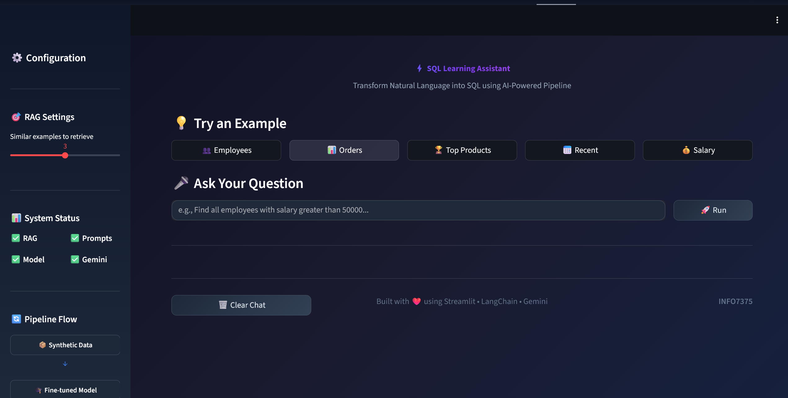
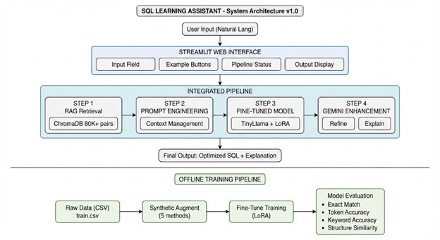

# SQL Learning Assistant

AI-Powered Natural Language to SQL Conversion using RAG, Fine-tuned LLM, and Gemini Enhancement.


## Live Demo

- **Web App:** [HuggingFace Spaces](https://huggingface.co/spaces/moheesh/sql-learning-assistant)
- **Project Page:** [GitHub Pages](https://moheesh.github.io/Prompt_to_SQL_using_RAG_LLM)

## Application Screenshot



## Overview

The SQL Learning Assistant is an intelligent chatbot designed to transform natural language questions into optimized SQL queries. It combines multiple generative AI techniques to deliver accurate, contextually-aware, and well-explained SQL statements.

**Target Users:**
- SQL beginners learning database querying
- Data analysts needing quick query prototypes
- Developers seeking SQL syntax assistance
- Students studying database management

**Key Capabilities:**
- Converts plain English questions to SQL queries
- Retrieves similar examples from a knowledge base of 80,000+ SQL pairs
- Generates explanations in simple, beginner-friendly language
- Handles edge cases and ambiguous queries gracefully

## System Architecture



The system implements a multi-stage AI pipeline:

1. **RAG Retrieval** - Finds similar SQL examples from ChromaDB vector store
2. **Prompt Engineering** - Constructs optimized prompts with context
3. **Fine-tuned Model** - Generates SQL using TinyLlama with LoRA
4. **Gemini Enhancement** - Refines queries and generates explanations

## Pipeline Flow


**Step-by-step Process:**

1. User enters a natural language question
2. System converts question to embedding vector
3. RAG retriever finds top-K similar examples from knowledge base
4. Prompt builder constructs structured prompt with examples and context
5. Fine-tuned TinyLlama model generates initial SQL query
6. Gemini API refines the query and checks for errors
7. System returns optimized SQL with natural language explanation

## Features

| Feature | Description |
|---------|-------------|
| **RAG Retrieval** | 80,000+ SQL examples indexed in ChromaDB with 4 chunking strategies |
| **Fine-tuned LLM** | TinyLlama 1.1B fine-tuned with LoRA on domain-specific SQL data |
| **Gemini Enhancement** | Query refinement, syntax validation, and explanation generation |
| **Prompt Engineering** | Context management, query intent analysis, and edge case handling |
| **Synthetic Data** | 5 augmentation techniques expanding dataset by 2.72x |
| **Auto Fallback** | Multiple API keys and models for reliable operation |

## Core Components

### 1. Retrieval-Augmented Generation (RAG)

- **Knowledge Base:** 80,654 question-SQL pairs
- **Vector Database:** ChromaDB with persistent storage
- **Embeddings:** all-MiniLM-L6-v2 (384 dimensions)
- **Chunking Strategies:** SQL clause extraction, complexity classification, keyword extraction, size categorization

### 2. Fine-Tuning

- **Base Model:** TinyLlama/TinyLlama-1.1B-Chat-v1.0
- **Method:** LoRA (Low-Rank Adaptation)
- **Configuration:** rank=16, alpha=32, dropout=0.1
- **Target Modules:** q_proj, v_proj, k_proj, o_proj

### 3. Prompt Engineering

- **System Prompts:** 4 specialized prompts (simple, complex, aggregation, modification)
- **Context Management:** Conversation history, schema awareness
- **Edge Case Handling:** 6 detection types with appropriate responses

### 4. Synthetic Data Generation

- **Techniques:** Synonym replacement, random insertion, random swap, structure variation, case variation
- **Quality Controls:** Length filters, diversity scoring, duplicate removal
- **Privacy:** Anonymization of emails, phone numbers, SSNs

## Project Structure

```
Prompt_to_SQL_using_RAG_LLM/
├── app.py                    # Streamlit web application
├── config.py                 # Central configuration
├── requirements.txt          # Dependencies
│
├── pipeline/
│   └── integrated.py         # Main pipeline orchestration
│
├── finetuning/
│   ├── prepare_data.py       # Data preparation
│   ├── train.py              # LoRA fine-tuning
│   ├── evaluate.py           # Model evaluation
│   └── inference.py          # SQL generation
│
├── rag/
│   ├── embeddings.py         # Sentence transformers
│   ├── knowledge_base.py     # ChromaDB builder
│   └── retriever.py          # LangChain retriever
│
├── prompts/
│   ├── prompt_builder.py     # Context management
│   └── system_prompts.py     # Prompt templates
│
├── synthetic/
│   ├── generate_data.py      # Data augmentation
│   └── synonyms.py           # Synonym dictionary
│
├── data/                     # Training datasets
├── outputs/                  # Results and checkpoints
├── chromadb_data/            # Vector database
├── icons/                    # Architecture diagrams
└── docs/                     # GitHub Pages
```

## Installation

### Prerequisites

- Python 3.10 or higher
- pip package manager
- Git

### Setup Instructions

```bash
# Clone repository
git clone https://github.com/moheesh/Prompt_to_SQL_using_RAG_LLM.git
cd Prompt_to_SQL_using_RAG_LLM

# Create virtual environment
python -m venv .venv

# Activate virtual environment
source .venv/bin/activate  # Linux/Mac
# .venv\Scripts\activate   # Windows

# Install dependencies
pip install -r requirements.txt

# Configure environment variables
cp .env.example .env
# Edit .env with your API keys

# Build knowledge base (first time only)
python rag/knowledge_base.py

# Run application
streamlit run app.py
```

## Configuration

### Environment Variables

Create a `.env` file in the project root:

```
# Gemini API (Required)
GEMINI_API_KEY=your-primary-api-key
GEMINI_API_KEY_FALLBACK_1=your-backup-key
GEMINI_MODEL=gemini-2.5-flash

# HuggingFace (For cloud deployment)
HF_MODEL_ID=moheesh/sql-tinyllama-lora
HF_CHROMADB_ID=moheesh/sql-chromadb
HF_TOKEN=your-hf-token
```

### Running Components Individually

```bash
# Build knowledge base
python rag/knowledge_base.py

# Generate synthetic data
python synthetic/generate_data.py

# Prepare training data
python finetuning/prepare_data.py

# Train model
python finetuning/train.py

# Evaluate model
python finetuning/evaluate.py

# Test pipeline
python pipeline/integrated.py
```

## Tech Stack

| Layer | Technology | Purpose |
|-------|------------|---------|
| Frontend | Streamlit | Interactive web interface |
| Base LLM | TinyLlama 1.1B | Foundation language model |
| Fine-tuning | LoRA (PEFT) | Parameter-efficient training |
| Vector DB | ChromaDB | Similarity search storage |
| Embeddings | all-MiniLM-L6-v2 | Text vectorization |
| Enhancement | Gemini API | Query refinement |
| Orchestration | LangChain | RAG pipeline |
| ML Framework | PyTorch | Training and inference |

## Evaluation Results

### Model Performance

| Metric | Score |
|--------|-------|
| Samples Evaluated | 50 |
| Keyword Accuracy | 91.33% |
| Structure Similarity | 91.07% |
| Token Accuracy | 47.21% |
| Exact Match | 0.00% |

### Knowledge Base

| Metric | Value |
|--------|-------|
| Total Documents | 80,654 |
| Training Set | 56,355 |
| Validation Set | 8,421 |
| Test Set | 15,878 |

### Synthetic Data

| Metric | Value |
|--------|-------|
| Original Samples | 52,527 |
| Synthetic Samples | 142,639 |
| Augmentation Factor | 2.72x |
| Avg Diversity Score | 0.283 |

## Deployment

### HuggingFace Spaces

The application is deployed on HuggingFace Spaces:

1. Model checkpoint hosted on HuggingFace Model Hub
2. ChromaDB files hosted on HuggingFace Dataset Hub
3. API keys stored in Spaces secrets
4. Auto-download on cold start

### Upload to HuggingFace

```bash
# Login to HuggingFace
huggingface-cli login

# Upload model
huggingface-cli upload moheesh/sql-tinyllama-lora outputs/finetuning/checkpoints/final/ --repo-type model

# Upload ChromaDB
huggingface-cli upload moheesh/sql-chromadb chromadb_data/ --repo-type dataset
```

## Usage Examples

**Simple Query:**
```
Input: "Find all employees with salary above 50000"
Output: SELECT * FROM employees WHERE salary > 50000
```

**Aggregation Query:**
```
Input: "Count total orders by customer"
Output: SELECT customer_id, COUNT(*) FROM orders GROUP BY customer_id
```

**Complex Query:**
```
Input: "Show top 5 products by revenue"
Output: SELECT product_name, SUM(price * quantity) as revenue 
        FROM products JOIN orders ON products.id = orders.product_id 
        GROUP BY product_name ORDER BY revenue DESC LIMIT 5
```

## API Reference

### Pipeline Usage

```python
from pipeline.integrated import IntegratedPipeline

pipeline = IntegratedPipeline()
result = pipeline.run(
    question="Find all employees with salary above 50000",
    enhance=True,
    explain=True,
    top_k=3
)

print(result['final_sql'])
print(result['explanation'])
```

### Retriever Usage

```python
from rag.retriever import SQLRetriever

retriever = SQLRetriever()
results = retriever.retrieve(query="Find employees", top_k=5)
```

## Contributing

1. Fork the repository
2. Create a feature branch (`git checkout -b feature/new-feature`)
3. Commit changes (`git commit -am 'Add new feature'`)
4. Push to branch (`git push origin feature/new-feature`)
5. Open a Pull Request

## Course

**INFO7375** - Generative AI  
**Institution:** Northeastern University  
**Term:** Fall 2024

## Author

**Moheesh K A**
- GitHub: [@moheesh](https://github.com/moheesh)
- LinkedIn: [moheesh-k-a](https://linkedin.com/in/moheesh-k-a-a95306169)
- Email: kavithaarumugam.m@northeastern.edu

## License

This project is licensed under the MIT License - see the [LICENSE](LICENSE) file for details.

## Acknowledgments

- WikiSQL dataset by Salesforce Research
- TinyLlama by Zhang et al.
- HuggingFace for model hosting
- Google for Gemini API